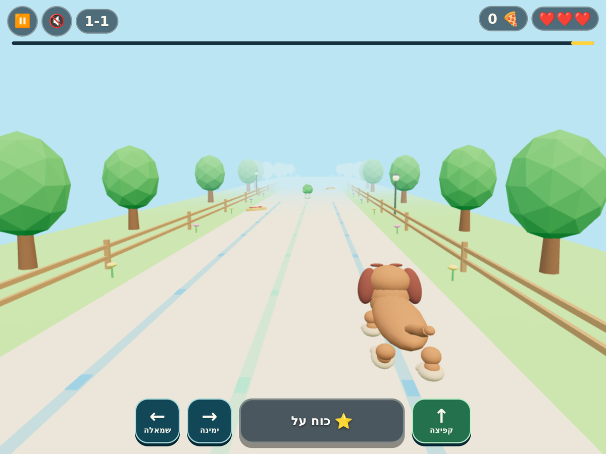
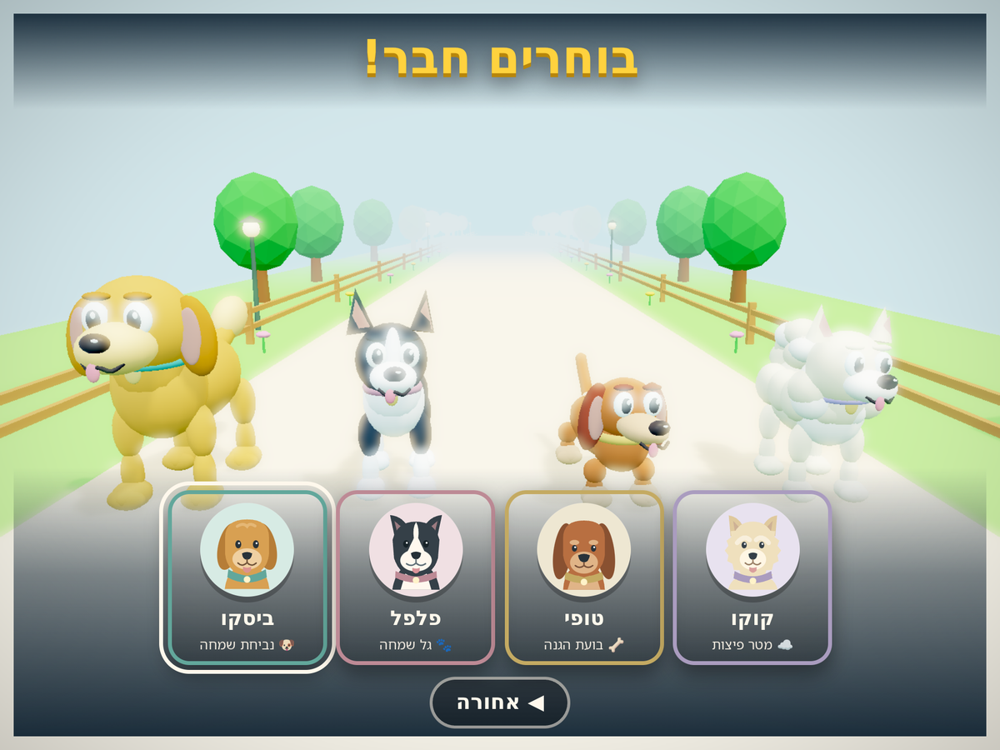

# Pizza Pups

A Hebrew, touch-first 3D browser runner starring four dogs: Biscuit, Pepper, Toffee and Coco. The nine-stage journey crosses a sunny dog park, a pizzeria and neighborhood rooftops. Three.js renders four-legged characters and scenery from procedural meshes; Web Audio synthesizes music and effects. The game combines an RTL interface with physical left/right movement, local progress recovery and an installable offline app shell.





## Run locally

No package installation, build step or backend is required to play. From the repository root:

```sh
python3 -m http.server 8000 --directory game
```

Open <http://localhost:8000/> in a browser with JavaScript and WebGL. Service workers require HTTPS or localhost; opening `index.html` as a local file does not install the offline shell.

## Gameplay and rendering

- Automatic forward movement, three lanes, jumping, collectible pizzas and character powers. Collisions reduce energy without ending the run; each world ends with a boss stage.
- Four distinct dog silhouettes: a golden retriever, a border collie, a dachshund and a cream spitz. SVG portraits and muted collar accents match the procedural models.
- Pointer dragging and tap-to-jump, separate native control buttons, and keyboard support. Hebrew labels use RTL while the directional control row uses physical left/right order.
- Procedural meshes, recycled ground chunks, explicit graphics-resource disposal and optional capability-gated bloom.
- Bounded simulation substeps, pause-aware timers and a render loop that stops behind opaque menus or while the page is hidden.
- Gentle pace, reduced motion, mute and three graphics-quality settings. The pixel budget limits rendering resolution independently of CSS layout.
- Nine saved best scores, twelve collectible stickers, a local recovery copy and monotonic progress merging across ordinary stale-window writes.

## Validation

Node.js 22 or later:

```sh
node --test tests/*.test.cjs
```

Python 3.12 and Playwright 1.55.0:

```sh
python3 -m venv .venv
. .venv/bin/activate
python -m pip install playwright==1.55.0
python -m playwright install --with-deps chromium webkit
python tests/simulation.py
python tests/family_flows.py
python tests/browser.py --engine chromium
# Linux WebKit uses a headed browser and needs a display.
xvfb-run -a python tests/browser.py --engine webkit
```

The simulation and interaction integration suites use the actual DOM and game callbacks with a controlled clock and a null renderer. The browser suite uses actual WebGL, checks offline reload by stopping its origin server, and writes screenshots and JSON reports to `test-results/`. Linux WebKit does not establish behavior on a physical iPad; synthesized audio is unit-tested with a mocked audio graph. See [QA.md](QA.md) for coverage and device checks.

## Structure

| Location | Responsibility |
| --- | --- |
| `game/core.js` | Save validation, progress merging, scoring, lane selection and pixel/timing budgets |
| `game/levels.js` | Nine stage schedules, collectible placement and bosses |
| `game/game.js` | Gameplay, input, screen state, lifecycle and graphics-resource ownership |
| `game/dogs.js` | Shared dog definitions, procedural models and running poses |
| `game/meshes.js` | Procedural scenery, props and visual effects |
| `game/audio.js` | Synthesized music/effects, interruption handling and voice cleanup |
| `game/postfx.js` | Optional bloom pipeline and render-target disposal |
| `game/style.css`, `game/polish.css` | RTL interface and responsive layouts |
| `game/assets/`, `game/app-icon.svg` | Dog portraits and application icon |
| `game/sw.js`, `game/install.js` | Scoped release cache, update lifecycle and install status |
| `tests/` | Rules, storage, timing, deployment configuration and browser checks |
| `.github/workflows/` | Quality checks and manually requested GitHub Pages publication gate |

Further documentation: [Hebrew game guide](game/README.md), [timing](docs/TIMING.md), [controls and saves](docs/CONTROLS_AND_SAVES.md), [deployment](docs/DEPLOYMENT.md), [third-party notices](THIRD_PARTY_NOTICES.md).

Progress stays in the browser for the current origin. There are no accounts, purchases, application analytics or cross-device synchronization. Clearing site data removes both local save copies.
