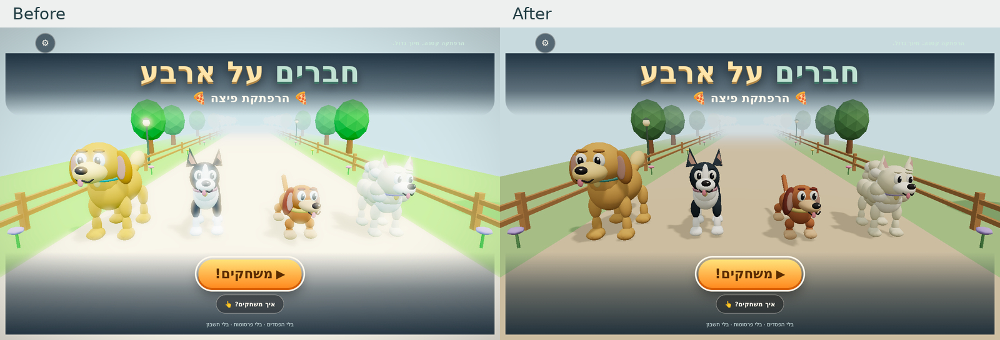

# Rendering

The Three.js r160 renderer uses soft daylight, matte procedural materials and selective HDR bloom. Dog coat colors, silhouettes and route markers remain readable across the park, pizzeria and neighborhood scenes.

## Color pipeline

The direct renderer and HDR composite use the same Three.js ACES filmic tone-mapping and sRGB output chunks, with exposure `1.0`. Color textures are marked as sRGB; lighting and intermediate render targets use linear sRGB.

| Mode | Rendering path |
| --- | --- |
| Direct | Linear scene → ACES → sRGB display output |
| HDR | Linear scene → highlight extraction and blur → linear composite → ACES → sRGB display output |

The sky is an unlit, inward-facing material sphere rather than a scene background color. It therefore passes through the same color transform in both modes. It has no fog or depth writes; world fog still applies to scene geometry.

HDR requires WebGL2 and `EXT_color_buffer_float`. Automatic and high quality enable it when supported; battery quality uses direct rendering. Both paths preserve the same underlying color treatment.

## Light and surfaces

- A filtered procedural sky supplies broad indirect light without bright studio-panel reflections. Hemisphere fill and a directional sun provide shape, with a weaker warm front light for faces.
- Dog fur uses roughness `0.92` and environment intensity `0.28`. Most world materials use environment intensity `0.32`; pots and vents retain a restrained satin response.
- The kitchen uses matte sand and terracotta tiles. Texture repeats follow floor width and depth, keeping tiles square across recycled chunks.
- Bloom selects linear luminance above `1.8`, with a `0.4` soft knee and composite strength `0.16`. Ordinary surfaces remain crisp; sufficiently bright effects can produce a small halo.
- Lamps and string lights use restrained emission. Rooftop lights sit above the player, while warm route markers provide lane guidance.

Bloom adds four render targets and several fullscreen passes. Battery quality avoids that cost; pixel-ratio limits also bound resolution. These choices reduce graphics work without establishing a particular frame rate or battery saving on physical devices.

## Resource ownership and recovery

Character geometry and materials belong to each instance. Ground texture maps are owned clones; cached source textures and the shared outline material survive chunk recycling. Disposal collects unique resources to avoid releasing a shared object repeatedly.

Environment generation releases its temporary scene and PMREM generator after filtering. The returned texture owns its render target and releases that target on disposal. The HDR pipeline releases its targets, shader materials and fullscreen geometry, including partial allocations if construction fails.

Quality changes dispose the old HDR pipeline before rebuilding. WebGL context loss pauses play and releases the HDR and environment resources; restoration rebuilds supported resources and preserves the pause until explicit resume.

## Validation

[The graphics browser suite](../tests/graphics_browser.py) reads actual WebGL pixels in Chromium and Linux WebKit. With bloom disabled for the parity probe, it compares 15 flat-color samples and nine world-sky samples across exposures `0.8`, `1.0` and `1.2`.

Both engines produced identical flat-color samples and a maximum sky-channel difference of one 8-bit code value; the assertions allow a tolerance of two. This checks the output transform, not whole-scene image equivalence with bloom enabled.

The suite also renders all three worlds, switches automatic/high/battery quality, checks resource counts across repeated rebuilds, and exercises real context loss and restoration through `WEBGL_lose_context`. Screenshots and JSON reports are written under `test-results/`.

Node checks cover pipeline capability gating, render-target state, allocation cleanup, disposal ownership and square floor UV mapping. Linux browser results do not certify physical iPad behavior, thermal performance, frame rate or battery life; device checks are described in [QA.md](../QA.md).
